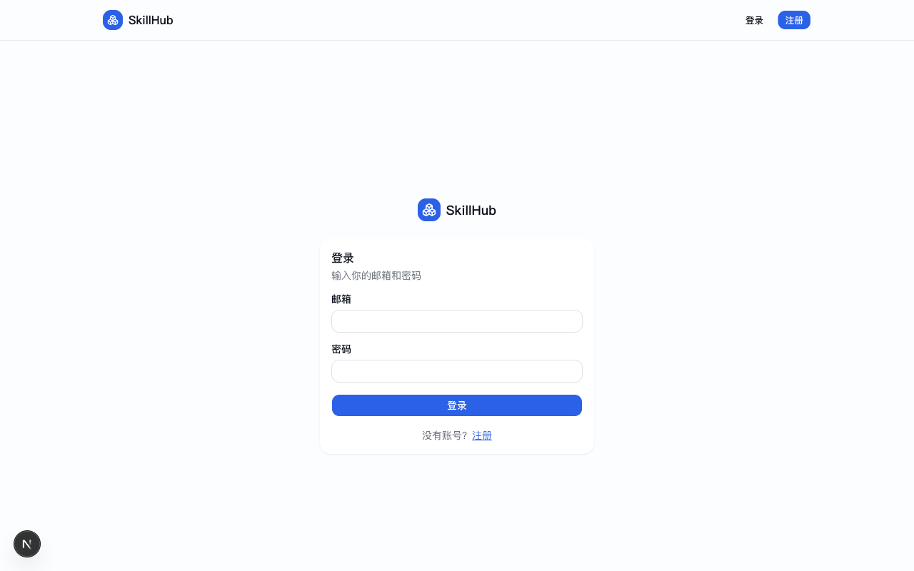
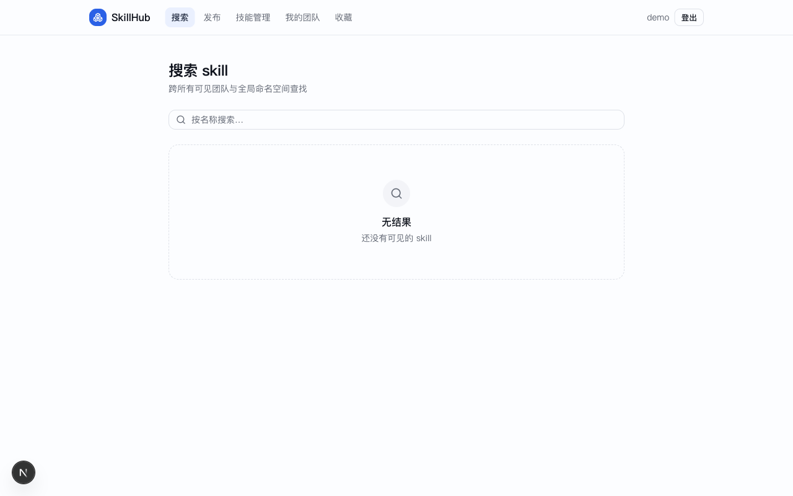
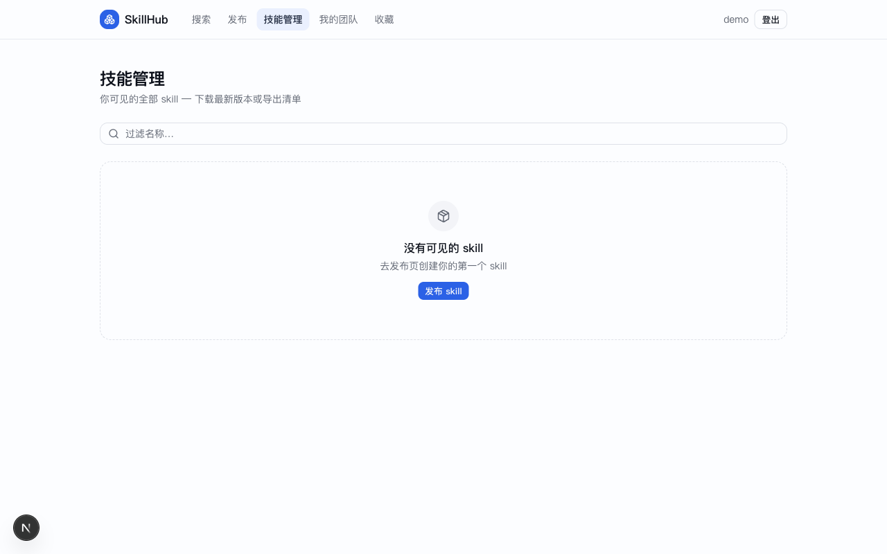
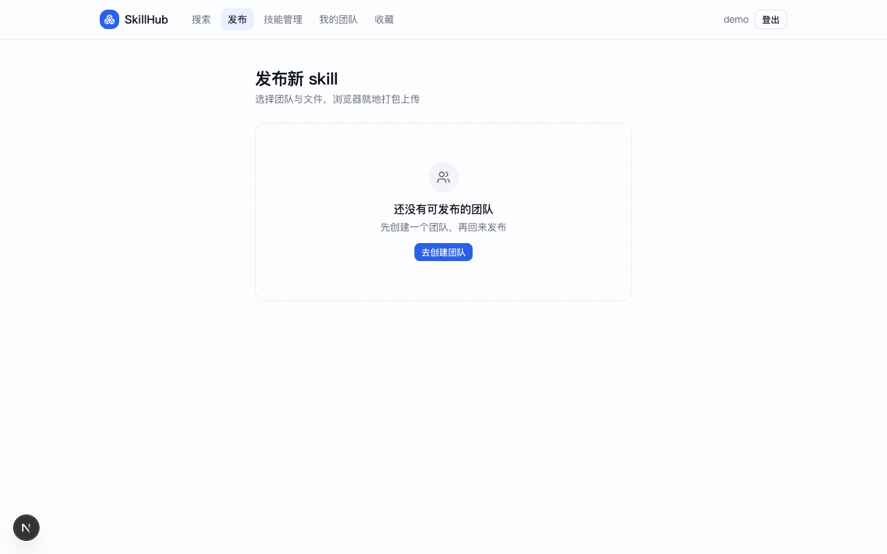

# SkillHub

企业级 skill 包管理平台。

## 界面预览

| 登录 | 搜索 |
| :---: | :---: |
|  |  |

| 我的 Skills | 发布 |
| :---: | :---: |
|  |  |

## 本地开发

```bash
make compose-up        # 起 PG + Redis + MinIO
make migrate-up        # 跑迁移
make run               # 起服务 :8080
```

健康检查：`curl http://localhost:8080/healthz`

## 测试

```bash
make test              # 单元测试
make test-integration  # 集成测试（需先 make compose-up）
```
